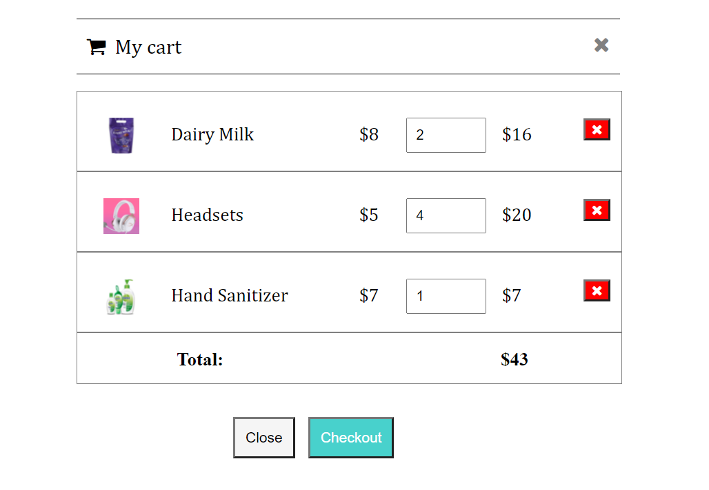

# Cart
This is a fully functional shopping cart created in HTML, CSS and Javascript using Object Oriented Programming. 

The cart contains list of items, with the description of each dispalyed. Along with the item image, item name, unit price it displays the item quantity and total price as well.
The total price of all products is displayed at the bottom. This cart allows you to remove any item, as well as to update the quantity of any item which updates the total price.

The cart looks as follows.

